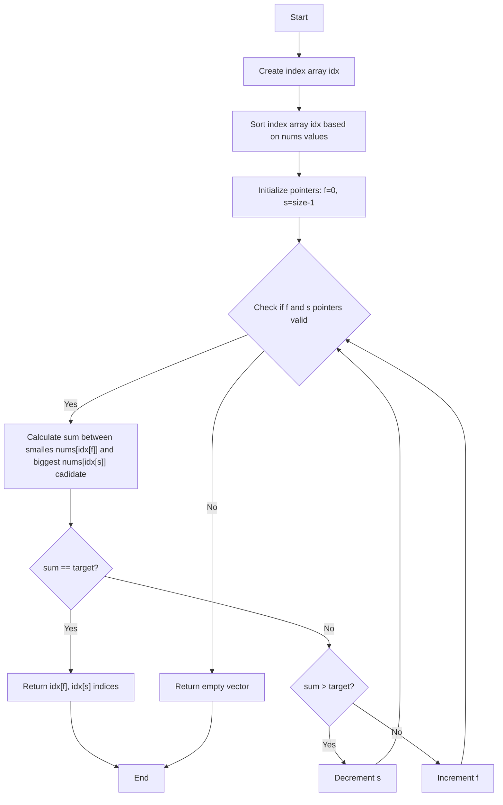

# collection of leetcode questions

my solution vs others testes with google benchmark (c), Leetcode’s performance measuring is too coarse and all the solutions end up in the 0ms bracket.

## twoSum




## reverse int 

my::reverse_int32 precalculated an lookup table for 2 digits so in theory it can eat the number up faster by doing modulo 100 and divide by 100 instead the trivial approach with 10.


```
Running ./build/src/reverse_int32/reverse_int32_benchmark
Run on (12 X 2592.01 MHz CPU s)
CPU Caches:
  L1 Data 32 KiB (x6)
  L1 Instruction 32 KiB (x6)
  L2 Unified 256 KiB (x6)
  L3 Unified 9216 KiB (x1)
Load Average: 0.08, 0.12, 0.09
----------------------------------------------------------------------------
Benchmark                                  Time             CPU   Iterations
----------------------------------------------------------------------------
bench<others::reverse_modulo_ten>   22400127 ns     22343004 ns           27
bench<my::reverse_int32>            11750695 ns     11715982 ns           50
```
