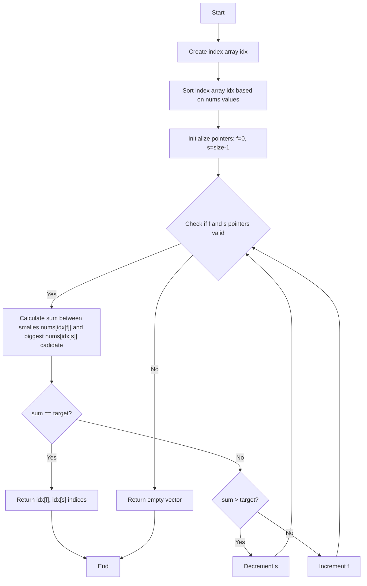

# collection of leetcode questions

my solution vs others testes with google benchmark (c), Leetcode’s performance measuring is too coarse and all the solutions end up in the 0ms bracket.

## twoSum




```vega
{
    "width" : 600,
    "height" : 400,
    "data" : {
        "values" : [
            {
                "range" : 16,
                "nanoseconds" : 2.40555e+06,
                "series" : "bench<my::twoSum_with_sort_array>"
            },
            {
                "range" : 32,
                "nanoseconds" : 6.60639e+06,
                "series" : "bench<my::twoSum_with_sort_array>"
            },
            {
                "range" : 64,
                "nanoseconds" : 1.55311e+07,
                "series" : "bench<my::twoSum_with_sort_array>"
            },
            {
                "range" : 128,
                "nanoseconds" : 3.55887e+07,
                "series" : "bench<my::twoSum_with_sort_array>"
            },
            {
                "range" : 256,
                "nanoseconds" : 8.00395e+07,
                "series" : "bench<my::twoSum_with_sort_array>"
            },
            {
                "range" : 512,
                "nanoseconds" : 1.78248e+08,
                "series" : "bench<my::twoSum_with_sort_array>"
            },
            {
                "range" : 1024,
                "nanoseconds" : 3.9259e+08,
                "series" : "bench<my::twoSum_with_sort_array>"
            },
            {
                "range" : 2048,
                "nanoseconds" : 8.56213e+08,
                "series" : "bench<my::twoSum_with_sort_array>"
            },
            {
                "range" : 4096,
                "nanoseconds" : 1.85746e+09,
                "series" : "bench<my::twoSum_with_sort_array>"
            },
            {
                "range" : 8192,
                "nanoseconds" : 4.00856e+09,
                "series" : "bench<my::twoSum_with_sort_array>"
            },
            {
                "range" : 16,
                "nanoseconds" : 2.45952e+06,
                "series" : "bench<my::twoSum_with_sort_vector>"
            },
            {
                "range" : 32,
                "nanoseconds" : 6.58065e+06,
                "series" : "bench<my::twoSum_with_sort_vector>"
            },
            {
                "range" : 64,
                "nanoseconds" : 1.53524e+07,
                "series" : "bench<my::twoSum_with_sort_vector>"
            },
            {
                "range" : 128,
                "nanoseconds" : 3.51368e+07,
                "series" : "bench<my::twoSum_with_sort_vector>"
            },
            {
                "range" : 256,
                "nanoseconds" : 7.94962e+07,
                "series" : "bench<my::twoSum_with_sort_vector>"
            },
            {
                "range" : 512,
                "nanoseconds" : 1.78025e+08,
                "series" : "bench<my::twoSum_with_sort_vector>"
            },
            {
                "range" : 1024,
                "nanoseconds" : 3.91766e+08,
                "series" : "bench<my::twoSum_with_sort_vector>"
            },
            {
                "range" : 2048,
                "nanoseconds" : 8.53781e+08,
                "series" : "bench<my::twoSum_with_sort_vector>"
            },
            {
                "range" : 4096,
                "nanoseconds" : 1.85324e+09,
                "series" : "bench<my::twoSum_with_sort_vector>"
            },
            {
                "range" : 8192,
                "nanoseconds" : 4.00847e+09,
                "series" : "bench<my::twoSum_with_sort_vector>"
            },
            {
                "range" : 16,
                "nanoseconds" : 5.43651e+06,
                "series" : "bench<others::twoSum_map>"
            },
            {
                "range" : 32,
                "nanoseconds" : 1.39401e+07,
                "series" : "bench<others::twoSum_map>"
            },
            {
                "range" : 64,
                "nanoseconds" : 3.22727e+07,
                "series" : "bench<others::twoSum_map>"
            },
            {
                "range" : 128,
                "nanoseconds" : 7.28688e+07,
                "series" : "bench<others::twoSum_map>"
            },
            {
                "range" : 256,
                "nanoseconds" : 1.6005e+08,
                "series" : "bench<others::twoSum_map>"
            },
            {
                "range" : 512,
                "nanoseconds" : 3.4516e+08,
                "series" : "bench<others::twoSum_map>"
            },
            {
                "range" : 1024,
                "nanoseconds" : 7.46233e+08,
                "series" : "bench<others::twoSum_map>"
            },
            {
                "range" : 2048,
                "nanoseconds" : 1.62655e+09,
                "series" : "bench<others::twoSum_map>"
            },
            {
                "range" : 4096,
                "nanoseconds" : 3635422405,
                "series" : "bench<others::twoSum_map>"
            },
            {
                "range" : 8192,
                "nanoseconds" : 8.41352e+09,
                "series" : "bench<others::twoSum_map>"
            },
            {
                "range" : 16,
                "nanoseconds" : 628386,
                "series" : "bench<others::twoSum_n_square>"
            },
            {
                "range" : 32,
                "nanoseconds" : 1.27867e+06,
                "series" : "bench<others::twoSum_n_square>"
            },
            {
                "range" : 64,
                "nanoseconds" : 4.12093e+06,
                "series" : "bench<others::twoSum_n_square>"
            },
            {
                "range" : 128,
                "nanoseconds" : 1.29716e+07,
                "series" : "bench<others::twoSum_n_square>"
            },
            {
                "range" : 256,
                "nanoseconds" : 4.62725e+07,
                "series" : "bench<others::twoSum_n_square>"
            },
            {
                "range" : 512,
                "nanoseconds" : 1.70747e+08,
                "series" : "bench<others::twoSum_n_square>"
            },
            {
                "range" : 1024,
                "nanoseconds" : 6.60796e+08,
                "series" : "bench<others::twoSum_n_square>"
            },
            {
                "range" : 2048,
                "nanoseconds" : 2.56531e+09,
                "series" : "bench<others::twoSum_n_square>"
            },
            {
                "range" : 4096,
                "nanoseconds" : 1.02502e+10,
                "series" : "bench<others::twoSum_n_square>"
            },
            {
                "range" : 8192,
                "nanoseconds" : 4.07071e+10,
                "series" : "bench<others::twoSum_n_square>"
            },
            {
                "range" : 16,
                "nanoseconds" : 4.29184e+06,
                "series" : "bench<others::twoSum_unordered_map>"
            },
            {
                "range" : 32,
                "nanoseconds" : 9.76219e+06,
                "series" : "bench<others::twoSum_unordered_map>"
            },
            {
                "range" : 64,
                "nanoseconds" : 2.05167e+07,
                "series" : "bench<others::twoSum_unordered_map>"
            },
            {
                "range" : 128,
                "nanoseconds" : 4.22997e+07,
                "series" : "bench<others::twoSum_unordered_map>"
            },
            {
                "range" : 256,
                "nanoseconds" : 1.16617e+08,
                "series" : "bench<others::twoSum_unordered_map>"
            },
            {
                "range" : 512,
                "nanoseconds" : 2.11523e+08,
                "series" : "bench<others::twoSum_unordered_map>"
            },
            {
                "range" : 1024,
                "nanoseconds" : 4.80315e+08,
                "series" : "bench<others::twoSum_unordered_map>"
            },
            {
                "range" : 2048,
                "nanoseconds" : 9.3998e+08,
                "series" : "bench<others::twoSum_unordered_map>"
            },
            {
                "range" : 4096,
                "nanoseconds" : 1.90713e+09,
                "series" : "bench<others::twoSum_unordered_map>"
            },
            {
                "range" : 8192,
                "nanoseconds" : 3.83292e+09,
                "series" : "bench<others::twoSum_unordered_map>"
            }
        ]
    },
    "mark" : {
        "type" : "line",
        "point" : true
    },
    "encoding" : {
        "x" : {
            "field" : "range",
            "type" : "quantitative",
            "title" : "Range Size",
            "scale" : {
                "type" : "log",
                "base" : 2
            }
        },
        "y" : {
            "field" : "nanoseconds",
            "type" : "quantitative",
            "title" : "Time (nanoseconds) log scale",
            "scale" : {
                "type" : "log",
                "base" : 2
            }
        },
        "color" : {
            "field" : "series",
            "type" : "nominal",
            "title" : "Implementation"
        },
        "tooltip" : [
            {
                "field" : "range",
                "type" : "quantitative",
                "title" : "Range Size"
            },
            {
                "field" : "nanoseconds",
                "type" : "quantitative",
                "title" : "Time (ns)"
            },
            {
                "field" : "series",
                "type" : "nominal",
                "title" : "Implementation"
            }
        ]
    },
    "title" : "Performance Comparison by Range Size",
    "config" : {
        "axis" : {
            "labelFontSize" : 12,
            "titleFontSize" : 14
        }
    }
}

```


## reverse int 

my::reverse_int32 precalculated an lookup table for 2 digits so in theory it can eat the number up faster by doing modulo 100 and divide by 100 instead the trivial approach with 10.


```
Running ./build/src/reverse_int32/reverse_int32_benchmark
Run on (12 X 2592.01 MHz CPU s)
CPU Caches:
  L1 Data 32 KiB (x6)
  L1 Instruction 32 KiB (x6)
  L2 Unified 256 KiB (x6)
  L3 Unified 9216 KiB (x1)
Load Average: 0.08, 0.12, 0.09
----------------------------------------------------------------------------
Benchmark                                  Time             CPU   Iterations
----------------------------------------------------------------------------
bench<others::reverse_modulo_ten>   22400127 ns     22343004 ns           27
bench<my::reverse_int32>            11750695 ns     11715982 ns           50
```
